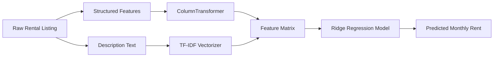
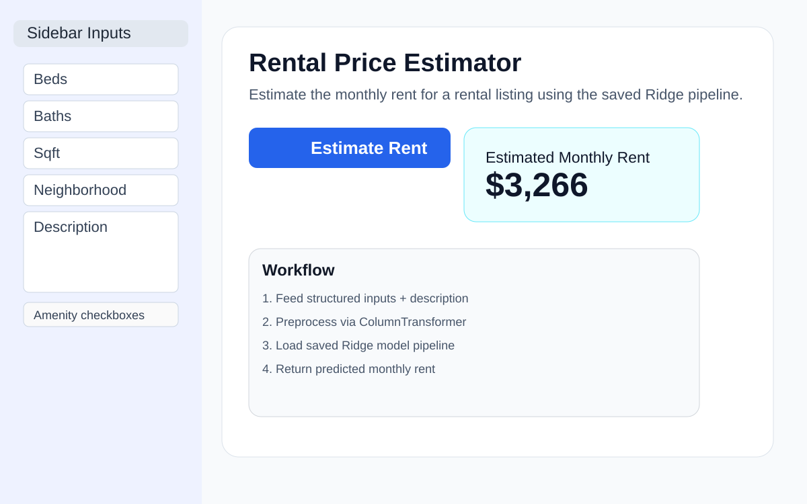
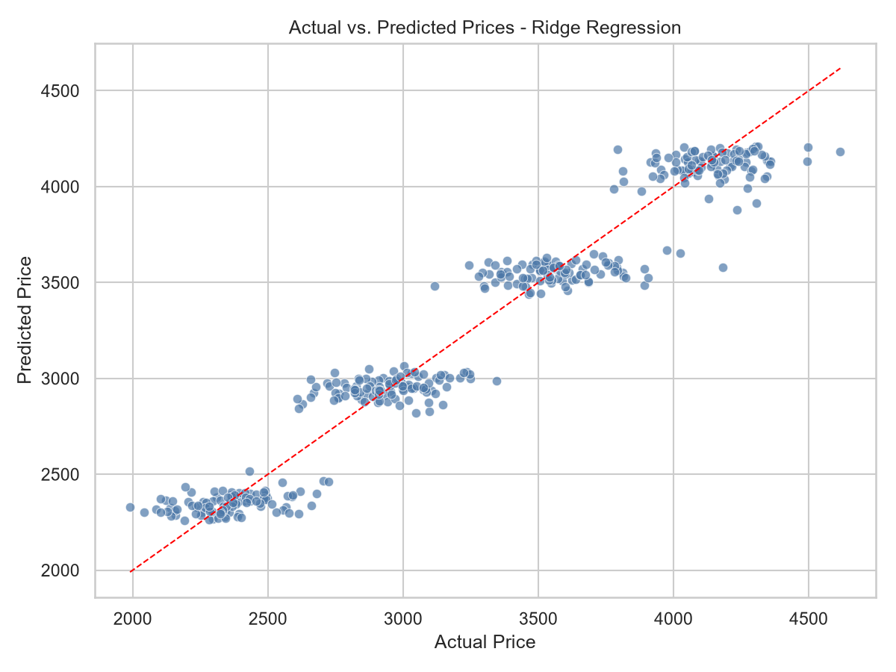
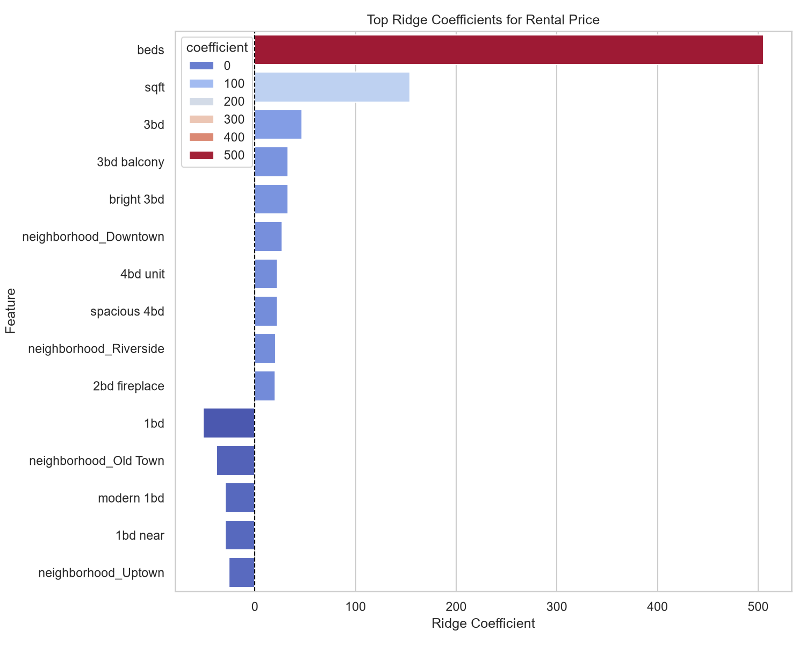

# Smart-Rent AI

<div align="center">


</div>

Smart-Rent AI is a rental price prediction project that combines structured housing features, unstructured property descriptions, and machine learning to estimate monthly rent for real estate listings.

The project demonstrates a practical production-style workflow for tabular + text data, including:
- synthetic rental data generation
- NLP-based amenity extraction from listing descriptions
- leakage-safe preprocessing with a `ColumnTransformer`
- model benchmarking between Ridge Regression and LightGBM
- an interactive Streamlit web app for rent estimation

## Project Overview

This project is designed to showcase how to:
1. generate realistic synthetic rental listing data,
2. convert raw text descriptions into useful numeric signals,
3. preprocess mixed structured and unstructured data safely,
4. benchmark multiple regression models,
5. deploy an interactive pricing estimator.

The workflow is implemented across a small set of scripts:
- `generate_data.py` – creates the synthetic rental dataset
- `01_eda.ipynb` – exploratory data analysis notebook
- `02_feature_engineering.py` – feature extraction and preprocessing
- `03_model_training.py` – model training, benchmarking, and artifact export
- `app.py` – Streamlit dashboard for predicting rent
- `rental_ridge_model.joblib` – serialized fitted preprocessing + Ridge pipeline

## Key Features

### NLP Amenity Extraction
The project extracts binary indicators from raw rental descriptions, including amenities such as:
- laundry
- parking
- pet-friendly status
- balcony
- hardwood floors

These handcrafted binary flags are added to the dataset to complement the structured numeric features.

### ColumnTransformer Preprocessing
A `ColumnTransformer` is used to safely preprocess mixed feature types:
- `TfidfVectorizer(ngram_range=(1, 2), max_features=100)` on the `description` text column
- `OneHotEncoder` on `neighborhood`
- `StandardScaler` on numeric columns
- passthrough on binary amenity columns

This setup helps capture important text n-grams like phrases such as "in-unit laundry" or "garage parking" while keeping the feature space manageable.

### Ridge Regression vs LightGBM Benchmark
The project compares:
- a baseline `Ridge Regression` model
- a `LightGBM Regressor` benchmark model

Both models are evaluated on the same holdout test set using:
- Root Mean Squared Error (RMSE)
- Mean Absolute Error (MAE)
- R-squared (R²)

## Installation

### Prerequisites
- Python 3.10+
- pip

### Install dependencies
```bash
pip install pandas numpy scikit-learn scipy matplotlib seaborn streamlit lightgbm joblib
```

If you prefer using the repository requirements file:
```bash
pip install -r requirements.txt
```

## Usage

### 1. Generate the synthetic dataset
```bash
python generate_data.py
```

### 2. Run exploratory analysis
Open the notebook:
```bash
01_eda.ipynb
```

### 3. Create preprocessing artifacts
```bash
python 02_feature_engineering.py
```

### 4. Train and benchmark models
```bash
python 03_model_training.py
```

This script trains the models, prints a Markdown comparison table, and saves the fitted preprocessing + Ridge pipeline to:
```bash
rental_ridge_model.joblib
```

### 5. Launch the Streamlit app
```bash
streamlit run app.py
```

Then input:
- beds
- baths
- sqft
- neighborhood
- description
- amenity checkboxes

and click **Estimate Rent** to get a predicted monthly rent.

## How It Works




## Streamlit UI

The app provides a clean sidebar-driven interface for entering the rental details and generating a rent estimate.



## Performance Results

The current benchmark on the synthetic rental dataset shows strong predictive performance:

- MAE: approximately $120/month
- R²: approximately 0.95

Example summary from the model comparison:

| Model | RMSE | MAE | R² |
| --- | ---: | ---: | ---: |
| Ridge Regression | 153.603 | 120.005 | 0.9495 |
| LightGBM Regressor | 163.970 | 126.432 | 0.9425 |

### Result Figures

#### Actual vs. Predicted Price — Ridge Regression



#### Top Ridge Coefficients for Rental Price



## Project Structure

```text
smart-rent-ai/
├── generate_data.py
├── 01_eda.ipynb
├── 02_feature_engineering.py
├── 03_model_training.py
├── app.py
├── preprocessing_utils.py
├── synthetic_rentals.csv
├── rental_ridge_model.joblib
└── requirements.txt
```

## Notes

This project is intentionally structured as a lightweight end-to-end machine-learning example for rental pricing using a synthetic dataset. It emphasizes realistic preprocessing patterns, feature engineering, and model evaluation rather than production-grade deployment.

## License

This project is provided for educational and demonstration purposes.
